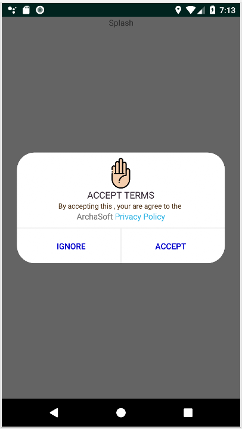

# Privacy Policy Dialog



# Step 1. Add the JitPack repository to your build file
 Add it in your root build.gradle at the end of repositories:
```
	allprojects {
		repositories {
			...
			maven { url 'https://jitpack.io' }
		}
	}
```

# Step 2. Add the dependency
```
	dependencies {
	        implementation "com.github.HmimssaSoufiane:PrivacyPolicyDialog:3.0.0"
		}
```
# Step 2. Go to your splash and add this code(put privacy  url and you store name)

```
 	Bundle args = new Bundle();
        args.putString("storeName","ArchaSoft ");
        args.putString("PrivacyURL","https://github.com/HmimssaSoufiane/PrivacyPolicyDialog");
        PrivacyPolicyDialog dialog=new PrivacyPolicyDialog();
        dialog.setArguments(args);
        dialog.show(getSupportFragmentManager(), "Text");
```
# Developed By

Made by Salah chnitfa and Hmimssa Soufiane 
